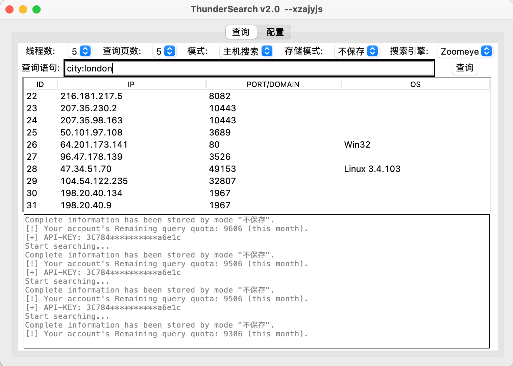
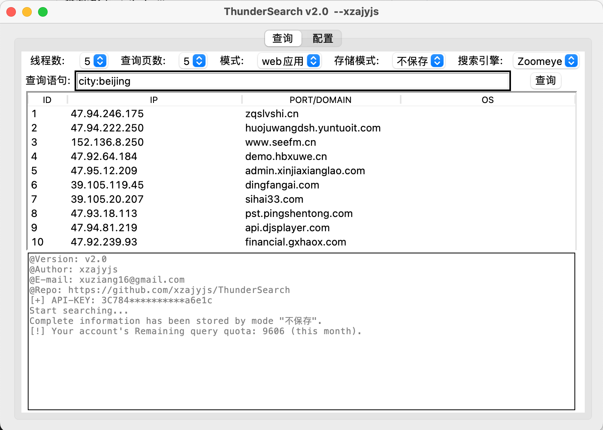

# <h1 align="center" >ThunderSearch 闪电搜索器</h1>
<p align="center">
    <a href="https://github.com/xzajyjs/ThunderSearch"></a>
    <a href="https://github.com/xzajyjs/ThunderSearch/releases"></a>
    <a href="https://github.com/xzajyjs/ThunderSearch/issues"></a>
    <a href="https://github.com/xzajyjs/ThunderSearch"></a>
    <a href="https://github.com/xzajyjs/ThunderSearch"></a>
    <a href="https://github.com/xzajyjs/ThunderSearch"></a>
</p>

## 🎸 Intro介绍
调用ZoomEye(即将支持Fofa、Hunter、Shodan等)的官方api，结合[开发文档](https://www.zoomeye.org/doc#user)，开发的GUI界面的信息搜集工具。支持查询`主机搜索`、`域名/IP`、`web应用搜索`、`个人信息`

- 支持通过通过图形化修改配置信息
- 支持账号密码和API-KEY登陆
- 支持多个网络资产搜索引擎(即将支持)
- 查询显示结果仅为部分，完整内容保存至`指定文件`或`数据库`
- 支持查询用户个人信息

---
## 💡 使用方式
### -> Run  
- 直接运行即可。每次通过GUI修改配置后务必`保存配置`
- 每种搜索引擎支持两种登录方式(账户密码/API-KEY)，选其一即可，优先使用API-KEY登录

#### 配置文件`config.json`说明
```
"zoomeye_username": ""
"zoomeye_password": ""
"zoomeye_api": ""
"fofa_username": ""
"fofa_password": ""
"fofa_api": ""
"file": ""
"host": ""
"port": ""
"database": ""
"username": ""
"password": ""
```

### -> Build
```
pip install -r requirements.txt
```
> Recommend Python version: 3.8+
---
## 📡 支持统计内容
### 主机搜索
| 统计项 | 类型 | 说明 |
| :-----: | :----: | :----: |
| ip | string | ip地址 |
| port | string | 端口 |
| os | string | 操作系统 |
| app | string | 应用、设备等 |
| version | string | 应用版本号 |
| title | string | 标题 |
| city | string | 城市 |
| country | string | 国家 |
| continents | string | 大洲 |

### 域名/IP
| 统计项 | 类型 | 说明 |
| :-----: | :----: | :----: |
| ip | string | ip地址 |
| name | string | 域名 |

### web应用搜索
| 统计项 | 类型 | 说明 |
| :-----: | :----: | :----: |
| ip | string | ip地址 |
| site | string | 站点 |
| city | string | 城市 |
| country | string | 国家 |
| continent | string | 大洲 |
| isp | string | 网络服务提供商 |

---
## 💻 TODO List
- [x] 代码重构
- [x] 优化登陆模式
- [x] 增加web应用搜索模块
- [x] 增加多种结果导出模式
- [ ] 支持多种搜索引擎，如Shodan、Fofa、Hunter、Quake等
---
## 🏝 更新日志
#### v2.0
- 优化配置设置
- 全新界面
- 支持Fofa(即将开放)

#### v1.7.6
- 增加数据不保存模式

#### v1.7.5
- 增加web应用搜索
- 增加导出至mysql数据库
- 加入更多查询内容

#### v1.7
- 代码重构
- 优化登陆逻辑
- 修复bug

#### v1.6
- 增加读取json文件登陆
- 修改敏感信息为隐式显示
- 优化登陆逻辑

#### v1.5.1
- 修复致命bug(**建议更新至此版本及更新**)
- 增加API-KEY登陆
- 调整界面布局

#### v1.3
- 增加个人信息查询模式
- 设置界面不可缩放
- 汉化了模式选择菜单
> 注：从此版本后将不再发布windows打包版本

#### v1.2
- 新增域名/ip互查
- 修复二次查询后结果不清空的bug
- 调整界面布局

#### v1.0
- 多线程支持

---
## 🌏 效果演示
  
  
  
  