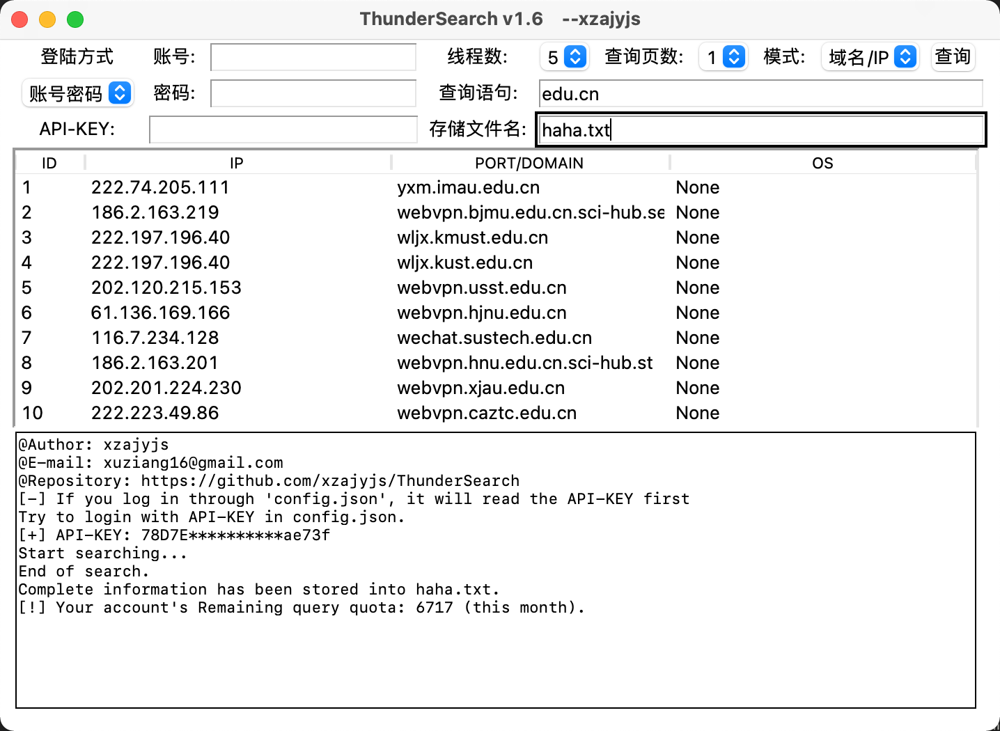
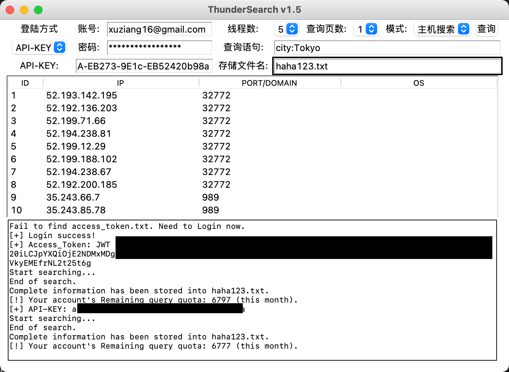
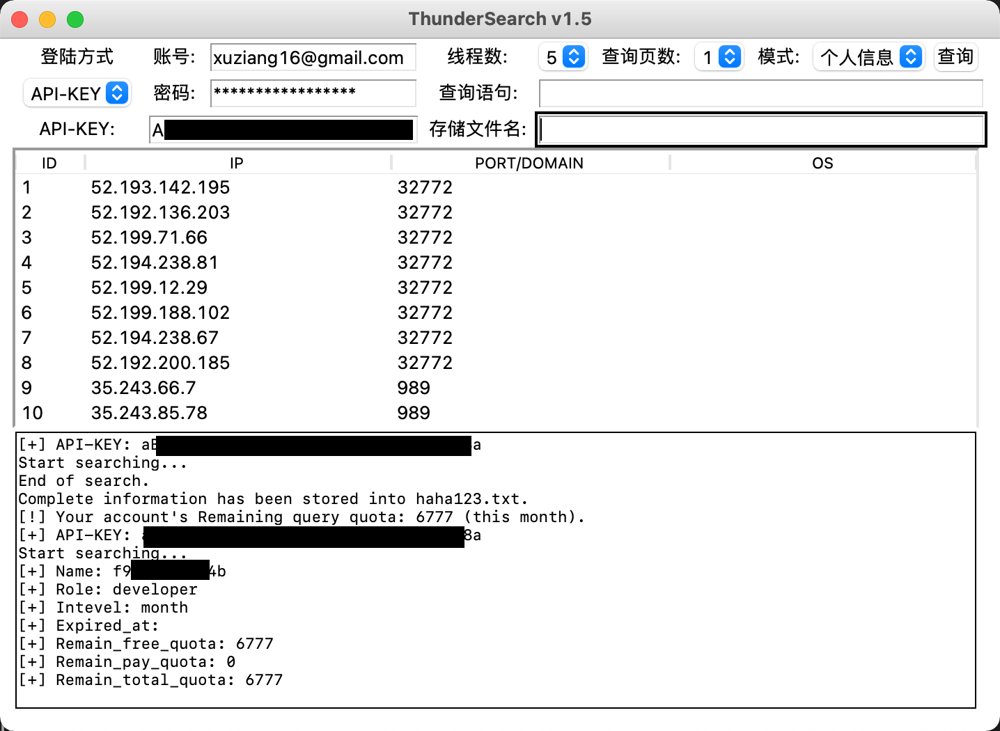

# ThunderSearch 闪电搜索器

## Intro
利用ZoomEye的官方api，结合[开发文档](https://www.zoomeye.org/doc#user)，做了这么一个GUI界面的搜索器。目前支持查询`主机搜索`、`域名/IP`、`个人信息`

- 支持本地`access_token.txt`文件的读取(免登陆)
- 支持读取`config.json`文件进行登陆
- 支持GUI界面账号(邮箱)+密码登录和API-KEY登陆
- 查询显示结果仅为部分，完整内容保存至`指定文件`
- 支持查询用户个人信息

---
## How to use
->Run  
- 填写当前目录的`config.json`文件进行登陆(优先读取`API-KEY`)  
- 或在GUI界面进行登陆

->Build
```
pip install -r requirements.txt
```
> Recommend Python version: 3.8+
---
## Update Log

#### v1.6
- 增加读取json文件登陆
- 修改敏感信息为隐式显示
- 优化登陆逻辑

#### v1.5.1
- 修复致命bug(**建议更新至此版本及更新**)
- 增加API-KEY登陆
- 调整界面布局

#### v1.3
- 增加个人信息查询模式
- 设置界面不可缩放
- 汉化了模式选择菜单
> 注：从此版本后将不再发布windows打包版本

#### v1.2
- 新增域名/ip互查
- 修复二次查询后结果不清空的bug
- 调整界面布局

#### v1.0
- 多线程支持

---








