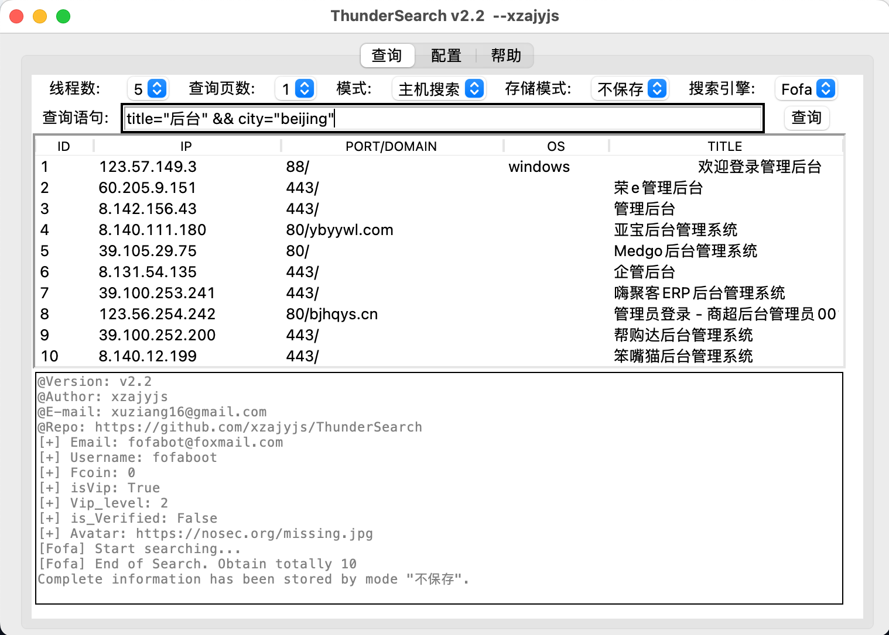
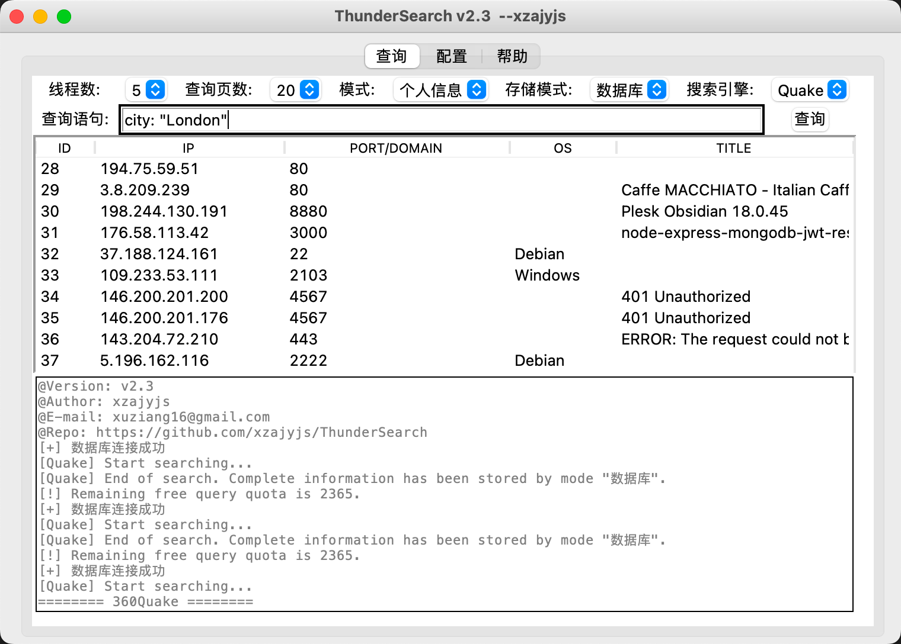
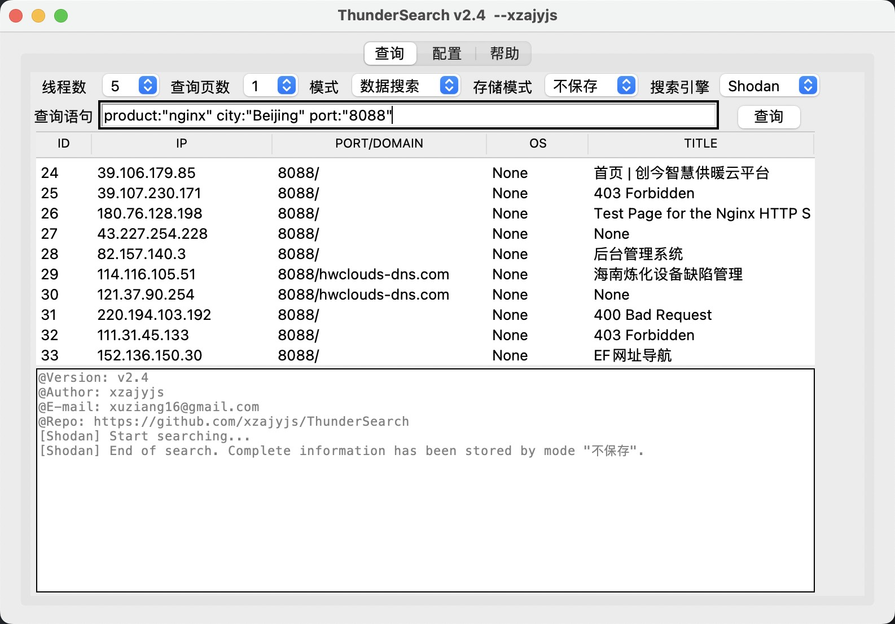
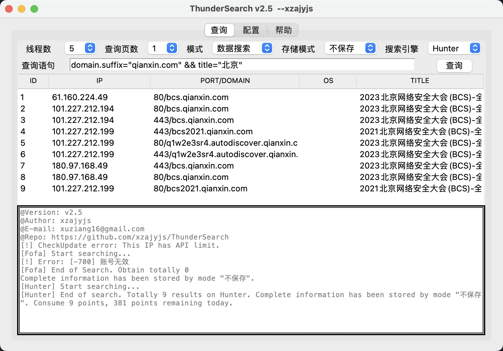
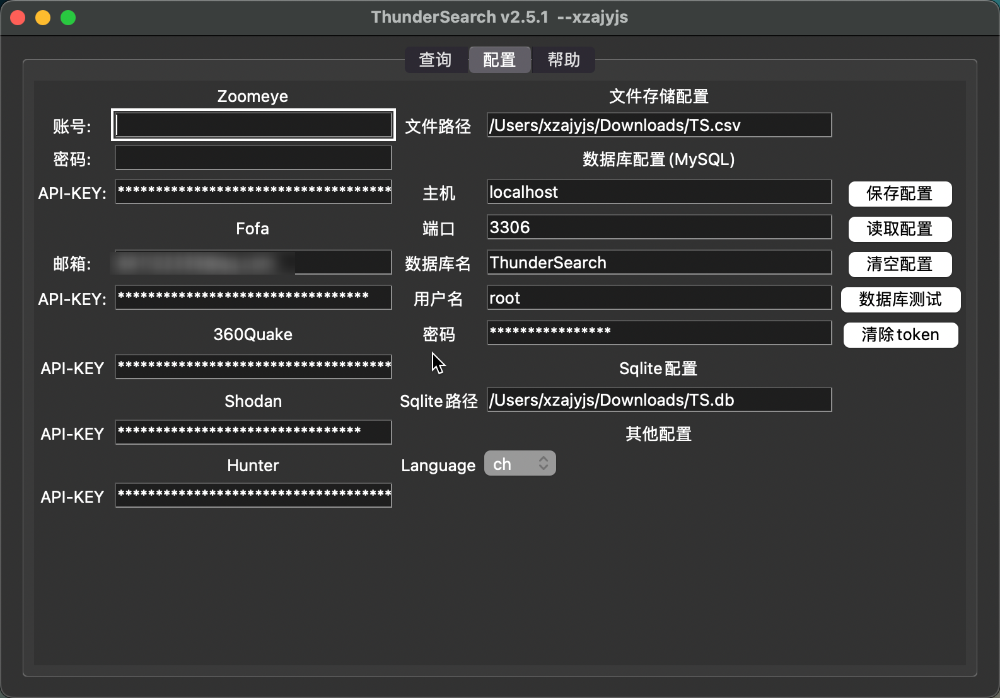
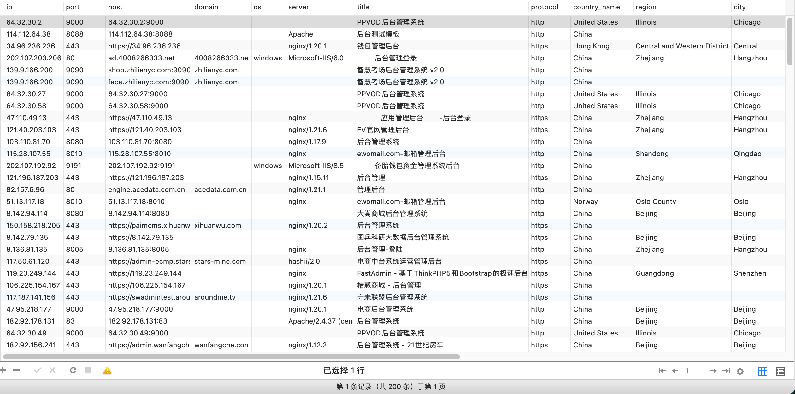
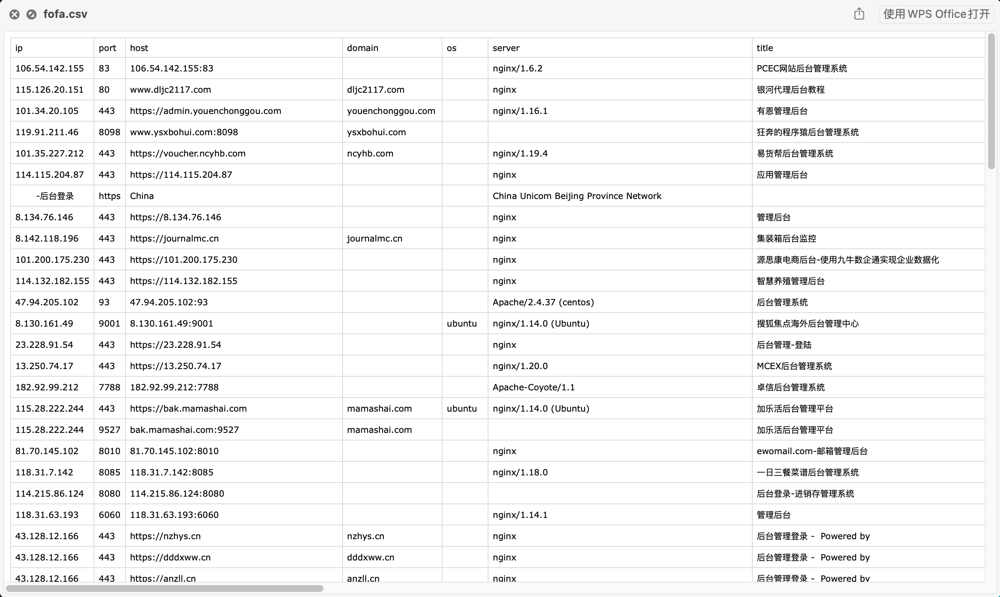

# <h1 align="center" >ThunderSearch 闪电搜索器</h1>
<p align="center">
    <a href="https://github.com/xzajyjs/ThunderSearch"></a>
    <a href="https://github.com/xzajyjs/ThunderSearch/releases"></a>
    <a href="https://github.com/xzajyjs/ThunderSearch/issues"></a>
    <a href="https://github.com/xzajyjs/ThunderSearch"></a>
    <a href="https://github.com/xzajyjs/ThunderSearch"></a>
    <a href="https://github.com/xzajyjs/ThunderSearch"></a>
</p>

## 🎸 Intro介绍 ([EN_README](README_EN.md))
ThunderSearch（闪电搜索器）是一款使用多个(目前支持`Fofa`、`Shodan`、`Hunter`、`Zoomeye`、`360Quake`)网络空间搜索引擎官方api开发的GUI界面的信息搜集工具。具体支持查询项[点此](Intro/Statistics.md)

- 支持通过通过图形化修改配置信息
- 支持账号密码和API-KEY登陆
- 支持多个网络资产搜索引擎
- 查询显示结果仅为部分，完整内容保存至`指定文件`或`数据库`
- 支持查询用户个人信息

---
## 💡 使用方式
### -> Run  
- 直接运行即可。每次通过GUI修改配置后务必`保存配置`
- Zoomeye支持两种登录方式(账户密码/API-KEY)，选其一即可，优先使用API-KEY登录。Fofa需同时填写邮箱和API-KEY。Quake仅需填写API-KEY

#### 配置文件`config.json`说明
```
"language": "en"
"zoomeye_username": ""
"zoomeye_password": ""
"zoomeye_api": ""
"fofa_username": ""
"fofa_api": ""
"quake_api": ""
"shodan_api": ""
"hunter_api": ""
"file": ""
"host": ""
"port": ""
"database": ""
"username": ""
"password": ""
```

> 通过界面中的`Language`选项来修改语言。同时也可通过修改`language`的值来修改语言。目前支持：`ch`(中文), `en`(英文)

### -> 构建和运行
```
pip3 install -r requirements.txt
python3 ThunderSearch.py
```
> 推荐Python版本: 3.9，3.10，3.12（注意，3.11在Mac Sonoma上可能会出现bug）
---
## 📡 支持统计内容

[查看详情](Intro/Statistics.md)

---
## 🏝 更新日志

[查看详情](Intro/Update.md)

---
## 🌏 效果演示
 
 


  
  
